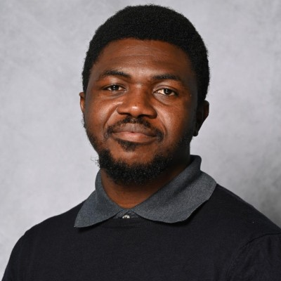

---
hide:
  - navigation
  - toc
description: "Dare Badejo — Applied Scientist specializing in AI-driven decision systems, stochastic optimization, and sustainability analysis (LCA/TEA) at Dow. PhD in Chemical Engineering from the University of Delaware."
---

# Dare Badejo | Applied Scientist & AI Researcher

### AI-Driven Decision Systems · Stochastic Optimization · Sustainability (LCA/TEA)

**Designing decision systems for resilient, efficient, and sustainable industrial operations.**

With a PhD in Chemical Engineering from the University of Delaware and hands-on industry experience at Dow, I bring together advanced optimization, stochastic modeling, agent-based systems, and sustainability analysis (LCA/TEA) to solve complex industrial challenges. My work bridges the gap between rigorous academic research and practical, high-impact solutions.

[View Work](work.md){ .md-button .md-button--primary }
[About Me](about.md){ .md-button }
[Research](research.md){ .md-button }
[Contact](contact.md){ .md-button }

{ .profile-img }

---

### :material-brain: AI & Decision Systems

Building intelligent decision frameworks that combine optimization, machine learning, and domain expertise to drive operational excellence in industrial settings.

### :material-chart-scatter-plot: Optimization Under Uncertainty

Developing stochastic and mixed-integer models that account for real-world disruptions, enabling robust planning and scheduling for supply chains and manufacturing.

### :material-leaf: Sustainability & LCA/TEA

Quantifying environmental and economic trade-offs using Life Cycle Assessment and Techno-Economic Analysis to guide strategic decisions toward sustainable industrial operations.

### :material-link-variant: Bridging Research & Industry

Translating cutting-edge academic research into actionable solutions with measurable business and societal impact at organizations like Dow.

---

## Technical Skills

| Category | Technologies & Methods |
|----------|----------------------|
| **Programming & Modeling** | Python, GAMS, Pyomo, MATLAB, SQL, R |
| **Optimization** | Mixed-Integer Programming (MIP), Stochastic Programming, Multi-Objective Optimization |
| **AI & Machine Learning** | Predictive Analytics, Interpretable ML, Agent-Based Modeling |
| **Sustainability** | Life Cycle Assessment (LCA), Techno-Economic Analysis (TEA), AWARE Water Footprint |
| **Data & Visualization** | Pandas, NumPy, Matplotlib, Tableau, Power BI |
| **Tools & Platforms** | Git, Docker, Linux, HPC Clusters, Jupyter |
