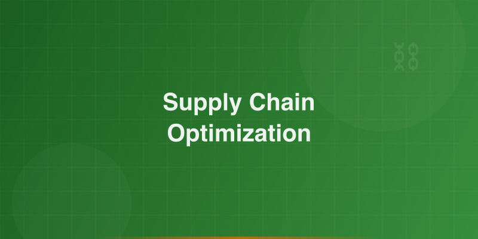
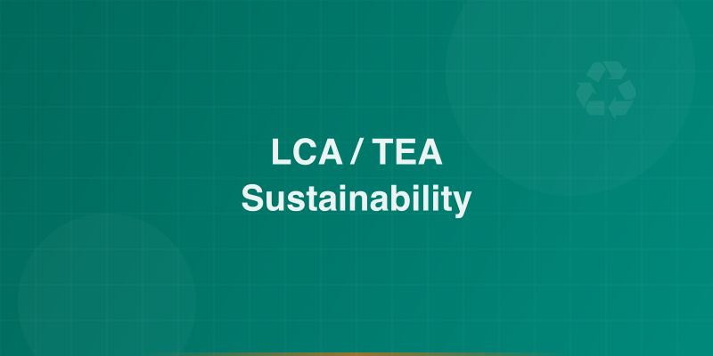
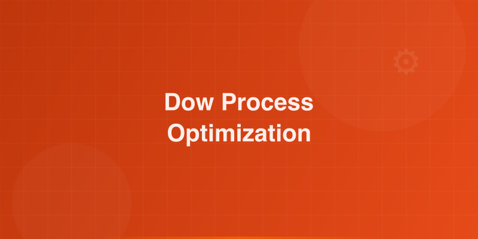

# Work

Selected projects presented in case-study format, demonstrating how advanced modeling and optimization drive measurable impact across industries.

---

## 1. Partial Disruption Modeling for Pharmaceutical Supply Chains

{ .project-img }

!!! info "Decision Problem"
    Pharmaceutical supply chains are vulnerable to partial disruptions, capacity losses that degrade performance without fully shutting down operations. Traditional models assume total disruption, leading to misallocated resources and suboptimal contingency plans.

**Model:** Developed a stochastic mixed-integer programming framework that captures partial disruption scenarios, modeling capacity degradation as a continuous spectrum rather than a binary event.

**Insight:** Partial disruptions account for a significant share of real-world supply chain losses, yet are systematically underestimated by conventional risk models. Incorporating them reveals hidden vulnerabilities and unlocks more cost-effective mitigation strategies.

**Impact:**

- Improved supply chain resilience by identifying previously invisible risk exposure
- Reduced expected disruption costs through targeted mitigation investments
- Provided decision-makers with a more realistic risk landscape for strategic planning

---

## 2. Agent-Based Advisor-Student Matching Optimization

{ .project-img }

!!! info "Decision Problem"
    Matching graduate students with faculty advisors is a complex, multi-stakeholder problem where misalignment leads to attrition, reduced research productivity, and suboptimal outcomes for both parties.

**Model:** Designed an agent-based simulation framework where students and advisors act as autonomous agents with heterogeneous preferences, constraints, and objectives. The model optimizes matching quality across multiple dimensions.

**Insight:** Systematic, data-driven matching significantly outperforms ad hoc or purely preference-based approaches, reducing mismatch rates and improving long-term outcomes.

**Impact:**

- Demonstrated measurable improvement in match quality over baseline methods
- Provided a scalable framework adaptable to other matching and allocation problems
- Highlighted the value of multi-agent modeling for institutional decision-making

---

## 3. Sustainability Modeling & LCA/TEA for Industrial Systems

{ .project-img }

!!! info "Decision Problem"
    Industrial operators face growing pressure to reduce environmental footprint while maintaining economic viability. Quantifying the true cost-sustainability trade-off is essential for informed capital allocation and regulatory compliance.

**Model:** Built integrated Life Cycle Assessment (LCA) and Techno-Economic Analysis (TEA) models incorporating AWARE water footprint methodology, enabling holistic evaluation of environmental and economic performance across process alternatives.

**Insight:** Sustainability and cost optimization are not always in conflict. Rigorous LCA/TEA analysis reveals scenarios where environmental improvements align with economic gains, and identifies the decision boundaries where trade-offs become unavoidable.

**Impact:**

- Quantified environmental and economic performance for multiple process configurations
- Enabled data-driven capital allocation decisions aligned with sustainability targets
- Delivered actionable recommendations for industrial stakeholders and policymakers

---

## 4. Dow Industrial Process Optimization

{ .project-img }

!!! info "Decision Problem"
    Large-scale chemical manufacturing operations require continuous process optimization to maintain efficiency, reduce waste, and respond to shifting market and regulatory conditions.

**Model:** Applied advanced optimization and data analytics to real-world industrial processes at Dow, integrating process data with mathematical models to identify efficiency gains and operational improvements.

**Insight:** Bridging the gap between academic optimization methods and plant-floor reality requires not only technical rigor but deep collaboration with operations teams and a pragmatic approach to model deployment.

**Impact:**

- Delivered measurable efficiency improvements in target processes
- Strengthened the bridge between R&D and operations
- Demonstrated the practical value of optimization science in an industrial setting

---

## Professional Experience

| Role | Organization | Focus |
|------|-------------|-------|
| Scientist | DOW Chemicals | Sustainability, AI, Data Engineering |
| PhD Researcher | University of Delaware | Optimization, Data Science, Sustainability |
| Research assistant | University of Lagos | Process Design, Control and Optimization,|
| Oil field Engineer | Eunisell Limited | Oil field chemicals, Flow Assurance, Process Flow Diagram, Project Management |
| Process Engineering Intern | Shell | Industrial Process Optimization |
---

[Explore My Research](research.md){ .md-button .md-button--primary }
[Get In Touch](contact.md){ .md-button }
